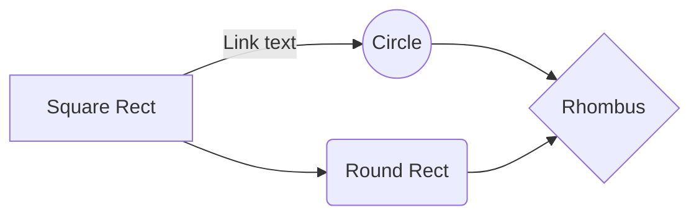

# UNO
AWS terminal game, UNO


And this will produce a flow chart:


```mermaid
graph LR
A[Square Rect] -- Link text --> B((Circle))
A --> C(Round Rect)
B --> D{Rhombus}
C --> D
```
```python
this is some python code stuff
more python code stuff 
```

    code code code
    

